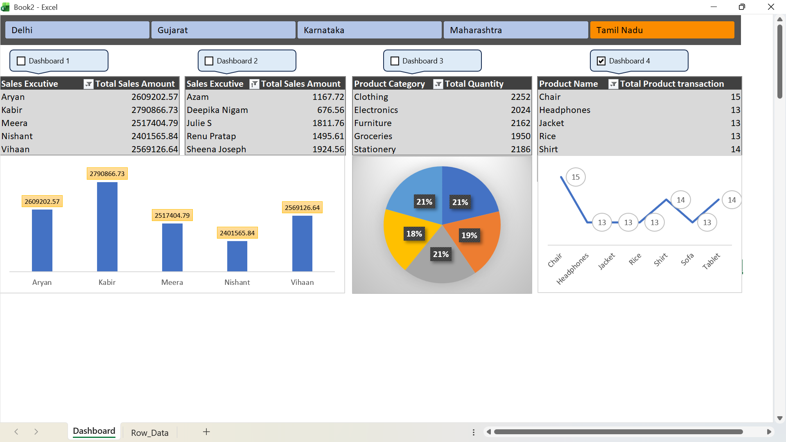

# Excel Sales Dashboard Analysis - Excel VBA Project

## Project Overview
This project is an interactive Excel-based Sales Analytics Dashboard developed to analyze sales performance, product transactions, and category-wise insights using charts, tables, and dashboard controls.

The dashboard helps users monitor:
- Sales Executive Performance
- Product Category Distribution
- Product Transactions
- State-wise Dashboard Navigation
- Business Trends and Insights

---

## Problem Statement
Businesses often struggle to monitor sales performance and identify trends efficiently. This dashboard solves the problem by providing a centralized and interactive platform to analyze:
- Sales Executive Performance
- Product Category Analysis
- Product Transactions
- State-wise Dashboard Filtering
- Quantity and Sales Insights

---

## Dataset
The dataset contains:
- Sales Executive Names
- Total Sales Amount
- Product Categories
- Product Transactions
- State-wise Sales Data

Dataset Format:
- Microsoft Excel (.xlsx)
- Microsoft Excel (.xlsm)
---

## Tools and Technologies
- Microsoft Excel
- Pivot Tables
- Pivot Charts
- Slicers
- Data Visualization
- Excel Form Controls
- VBA Code

---

## Methods
The following methods were used:
1. Data Cleaning
2. Data Organization
3. Pivot Table Creation
4. Chart Visualization
5. Dashboard Design
6. Interactive Filtering using Controls

---
## Dashboard Preview
 
---

## Key Insights
- Kabir achieved the highest sales amount.
- Clothing and Stationery categories showed high quantity sales.
- Chair product recorded the highest transaction count.
- Tamil Nadu state dashboard shows balanced category performance.
- Interactive filters improve business decision-making.
- The dashboard provides easy comparison between multiple business metrics.

---

## Dashboard Features
- Interactive Excel Dashboard
- Dynamic Charts
- Easy Navigation
- Clean User Interface
- Real-Time Data Representation
- Multi-Chart Analysis

---

## Project Structure

```bash
excel-sales-dashboard-analysis/
│
├── Dashboard/
│   └── Sales_Dashboard.xlsm
│
├── Images/
│   └── dashboard-preview.png
│
├── Dataset/
│   └── sales_data.xlsx
│
└── README.md
```
---

## Result & Conclusion
The dashboard successfully provides a clear and interactive visualization of sales data. It helps users quickly understand business performance, identify trends, and make data-driven decisions effectively.

## Future Work

### Future improvements can include:
Power BI Integration
Real-Time Database Connection
Advanced KPI Metrics
Forecasting and Predictive Analytics
Automated Reporting

---
## Author & Contact

---
### Author
Vikash Chauhan

### Contact
- LinkedIn: www.linkedin.com/in/vikashchauhan01
- GitHub: https://github.com/Vikashchauhan-dev
- Email: Vikashchauhan10211@gmail.com
---


